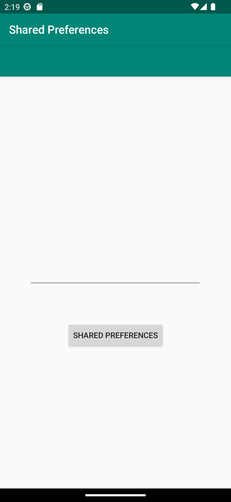

# Rapport
den första som skulle göras var att deklarera alla variabler i mainactivity. på activity main xml så lade jag till en editview och en knapp.

    button = findViewById(R.id.prefButton);
på knappen så satte jag också en onclick listener med intent för att komma till en annan activitet.

    button.setOnClickListener(new View.OnClickListener(){
    @Override
    public void onClick(View view) {
    Intent intent = new Intent(MainActivity.this, MainActivity2.class);
    startActivity(intent);
    }
    });
på min andra activity main xml så hade jag skapat en textview och en button.

    button = findViewById(R.id.prefButton);
    text = findViewById(R.id.settingseditview);

 på min mainactivity 2 så kallar jag på editview från activity main.

      button.setOnClickListener(new View.OnClickListener() {
            @Override
            public void onClick(View view) {
                myPreferenceEditor = myPreferenceRef.edit();
                myPreferenceEditor.putString("savepref", text.getText().toString());
                myPreferenceEditor.apply();
sen satte jag en onclick listener på knappen och när knappen trycks så sparas en sträng i de delade prefrenserna med nyckeln savepref och mainactivity startas och användaren dirigeras till den nya aktiviteten.

    @Override
    protected void onResume() {
    Log.d("onresumemain2", "onResume()");
    super.onResume();
    String savedText = myPreferenceRef.getString("savepref", "not found");
    textView.setText(savedText);
    }

koden är från main activity och den tar emot den texten som blev inmatad och skriver ut det 

när jag var klar med uppgiften så funkade det och när jag körde appen igen dagen efter så fick jag en error medelande om action bar så när jag tog bort den så funkade appen igen
//setSupportActionBar(toolbar);

